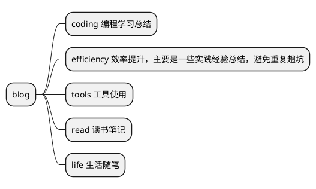

---
{"aliases":["基于Obsidian构建个人知识库"],"category":"tools","tags":["tools","obsidian","知识库"],"status":"publish","link":"NA","date created":"2023-01-02 Mon 19:33:43","date modified":"2023-01-06 Fri 20:22:41","dg-publish":true,"permalink":"/02.Blog/tools/基于Obsidian构建个人知识库/","dgPassFrontmatter":true}
---

<< [[01.Guide/tools\|tools]] | [[03.Diary/2023-01-02_Mon\|2023-01-02_Mon]]

> You cannot escape the responsibility of tomorrow by evading it today.  
> — <cite>Abraham Lincoln</cite>

关于 Obsidian 软件，在 [[02.Blog/tools/基于Obsidian发布静态博客\|基于Obsidian发布静态博客]] 中已有介绍，本文主要说明如何搭建自己的个人知识库。  

## 效果

主要实现功能如下：
- command + control + B：创建博客，输入文章名称，再输入文章类别，会依据模版创建文章并自动移动到对应目录下；
- command + control + D：依据模板创建当天日记，与前后一天的日记自动建链；
- 通过 dataview 访问文章元数据，博客自动显示在对应的索引文件中；
- 通过 memos 实现间歇式日记，可以方便地将事项和代办记录到当天的日记中，未完成的代办事件通过 checklist 会显示在右边栏方便跟踪；
- 通过 Linter 实现文章的自动格式化，元数据自动补齐更新；

## 博客框架

## 插件列表

- Dataview 笔记数据可视化
- Home Page 主页插件
- Tasks + Checklist 任务跟踪
- Calendar 日历插件，可以和 Templater、Memos 配合使用
- Memos 随手日记
- Templater + QuickAdd 快捷模版
- Linter md 文档自动格式化
- Admonition md 文档 tips 增强
- Clear unused images 自动清理未使用图片（typora 看哭了）
- Digital garden ob 文档发布

## 模板

[[04.Res/template/t-blog\|博客模板]]

[[04.Res/template/t-diary\|日记模板]]
