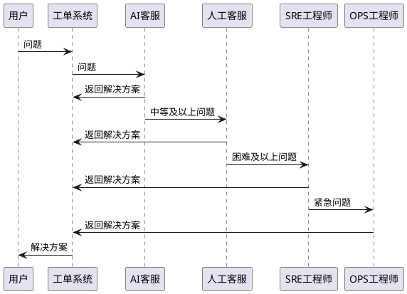

---
{"aliases":"行为设计模式之责任链","category":"coding","tags":["设计模式"],"status":"published","link":"NA","date created":"2023-02-11 Sat 15:39:00","date modified":"2024-02-21 Wed 19:05:01","dg-publish":true,"permalink":"/Blog/Learn/行为设计模式之责任链/","dgPassFrontmatter":true,"created":"2023-02-11 Sat 15:39:00","updated":"2024-02-21 Wed 19:05:01"}
---

> 开一个新系列，通过实例的方式解析下各种设计模式，加深理解和应用能力。  
> 理论内容主要来自于《深入设计模式》一书。

本文通过责任链模式实现一个简化的工单处理系统。

## 设计



## 实现

### TicketHandler - 顶层接口

```java
public interface TicketHandler {  
    String handleTicket(UserTicket ticket);  
}
```

### BaseTicketHandler - 基础抽象类

```java
public abstract class BaseTicketHandler implements TicketHandler{  
    private BaseTicketHandler nextHandler;  
  
    public void setNextHandler(BaseTicketHandler nextHandler) {  
        this.nextHandler = nextHandler;  
    }  
  
    @Override  
    public String handleTicket(UserTicket ticket) {  
        if (canHandler(ticket)) {  
            System.out.println("I can handle this ticket, get solution.");  
            return getSolution(ticket);  
        } else if (nextHandler != null) {  
            System.out.println("I can't handle this ticket, send to next handler.");  
            return nextHandler.handleTicket(ticket);  
        } else {  
            System.out.println("No one can handle this ticket.");  
            return "No answer.";  
        }  
    }  
  
    abstract boolean canHandler(UserTicket ticket);  
  
    abstract String getSolution(UserTicket ticket);  
}
```

### ConcreteHandlers - 具体实现类

```java
// AI客服
public class AiChatBot extends BaseTicketHandler {  
    @Override  
    boolean canHandler(UserTicket ticket) {  
        if (ticket.isEasy()) {  
            System.out.println("It's an easy ticket, ai chat bot can handle it.");  
            return true;  
        }  
        return false;  
    }  
  
    @Override  
    String getSolution(UserTicket ticket) {  
        return "AI chat bots answer.";  
    }  
}

// 人工客服
public class ManualCustomService extends BaseTicketHandler {  
    @Override  
    boolean canHandler(UserTicket ticket) {  
        if (ticket.isMiddle()) {  
            System.out.println("It's a middle ticket, manual custom service can handle it.");  
            return true;  
        }  
        return false;  
    }  
  
    @Override  
    String getSolution(UserTicket ticket) {  
        return "Manual custom services answer.";  
    }  
}

// SRE工程师
public class SreEngineer extends BaseTicketHandler {  
    @Override  
    boolean canHandler(UserTicket ticket) {  
        if (ticket.isHard()) {  
            System.out.println("It's a hard ticket, sre can handle it.");  
            return true;  
        }  
        return false;  
    }  
  
    @Override  
    String getSolution(UserTicket ticket) {  
        return "SRE engineer's answer.";  
    }  
}

// OPS工程师
public class OpsEngineer extends BaseTicketHandler {  
    @Override  
    boolean canHandler(UserTicket ticket) {  
        if (ticket.isCritical()) {  
            System.out.println("It's a critical ticket, must ops handle it.");  
            return true;  
        }  
        return false;  
    }  
  
    @Override  
    String getSolution(UserTicket ticket) {  
        return "Ops engineer's answer.";  
    }  
}
```

### Application

```java
public class UserTicketApplication {  
    private static final BaseTicketHandler handlerChain = getHandlerChain();  
  
    private static BaseTicketHandler getHandlerChain() {  
        BaseTicketHandler ops = new OpsEngineer();  
  
        BaseTicketHandler sre = new SreEngineer();  
        sre.setNextHandler(ops);  
  
        BaseTicketHandler manual = new ManualCustomService();  
        manual.setNextHandler(sre);  
  
        BaseTicketHandler ai = new AiChatBot();  
        ai.setNextHandler(manual);  
  
        return ai;  
    }  
  
    public String handleTicket(UserTicket ticket) {  
        return handlerChain.handleTicket(ticket);  
    }  
  
    public static void main(String[] args) {  
        UserTicketApplication app = new UserTicketApplication();  
  
        UserTicket easy = new UserTicket("easy", "how to create an account?", "iam", 2);  
        System.out.println(app.handleTicket(easy));  
        System.out.println("===");  
  
        UserTicket middle = new UserTicket("middle", "how to create a service demo?", "dli", 5);  
        System.out.println(app.handleTicket(middle));  
        System.out.println("===");  
  
        UserTicket hard = new UserTicket("hard", "how to create a cluster?", "mrs", 8);  
        System.out.println(app.handleTicket(hard));  
        System.out.println("===");  
  
        UserTicket critical = new UserTicket("critical", "my service is crashed!", "obs", 10);  
        System.out.println(app.handleTicket(critical));  
        System.out.println("===");  
  
        UserTicket other = new UserTicket("other", "hahaha", "noknown", 12);  
        System.out.println(app.handleTicket(other));  
    }  
}
```

### 数据类

```java
@Data  
@AllArgsConstructor  
public class UserTicket {  
    private String title;  
  
    private String content;  
  
    private String service;  
  
    private int score;  
  
    public boolean isEasy() {  
        return score > 0 && score <= 3;  
    }  
  
    public boolean isMiddle() {  
        return score > 3 && score <= 5;  
    }  
  
    public boolean isHard() {  
        return score > 5 && score <= 8;  
    }  
  
    public boolean isCritical() {  
        return score > 8 && score <= 10;  
    }  
}
```

## 结果

```shell
It's an easy ticket, ai chat bot can handle it.
I can handle this ticket, get solution.
AI chat bots answer.
===
I can't handle this ticket, send to next handler.
It's a middle ticket, manual custom service can handle it.
I can handle this ticket, get solution.
Manual custom services answer.
===
I can't handle this ticket, send to next handler.
I can't handle this ticket, send to next handler.
It's a hard ticket, sre can handle it.
I can handle this ticket, get solution.
SRE engineer's answer.
===
I can't handle this ticket, send to next handler.
I can't handle this ticket, send to next handler.
I can't handle this ticket, send to next handler.
It's a critical ticket, must ops handle it.
I can handle this ticket, get solution.
Ops engineer's answer.
===
I can't handle this ticket, send to next handler.
I can't handle this ticket, send to next handler.
I can't handle this ticket, send to next handler.
No one can handle this ticket.
No answer.
```

## 责任链模式

### 结构


- Handler：声明顶层接口，定义所有处理者的通用行为；
- BaseHandler：定义了保存下一个处理者引用的成员变量，并提供设置下一个处理者的方法。在本例中因为所有处理者的 handle() 基本动作相同，因此在抽象类中提供了默认的框架实现，并将有区别的具体动作声明为抽象方法，交给具体处理者去实现；
- ConcreteHandler：实现差异化的具体处理行为；
- 客户端：将多个具体处理者按需求组织成责任链；

**值得注意的是**：
- 请求可以发送给链上的任意一个处理者，而非必须是第一个处理者；
- 责任链的使用场景并非只有本文中所提及的实现（按照固定顺序寻找一个合适的 handler 处理请求并返回），也可以以链式方式实现通过多个 handler 对请求进行一系列的规范化或者选择性处理。

### 适用场景

- 当程序需要使用不同方式处理不同种类的请求，而且请求的类型和顺序预先未知时。-- **全量链路，选择性处理**
- 当必须以固定顺序执行多个处理者时。 -- **规范化流程处理**
- 当所需的处理者及其顺序在运行时能够根据需要动态修改，调整执行链路时。 -- **动态流程处理**

---

以上。
